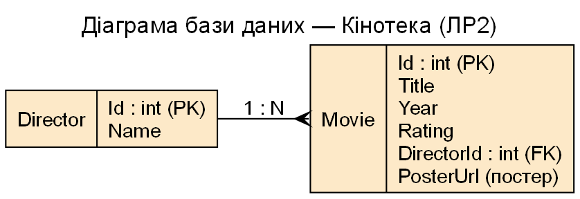

# ІСтаТП · ЛР2 «Кінотека» (ASP.NET Core Web API) — гілка етапу 2.3

**Виконавець:** Костащук Ярослав Васильович, група К26 · **Викладач:** Панченко Т. В.

Ця гілка показує стан проєкту на **етапі 2.3**. Нижче — що додано/змінено на кожному етапі (до цього включно).

## Прогрес по етапах
- **Етап 2.0** — формулювання завдання та діаграма прецедентів (Use-case) предметної області «Кінотека» (узгоджено з викладачем).
- **Етап 2.1** — застосунок Web API; модель (`Director`, `Movie`) і контекст `MovieContext` (EF Core, Code-First, PostgreSQL); підтримка **Docker** (Dockerfile + docker-compose).
- **Етап 2.2** — контролери `MoviesController`/`DirectorsController` (REST: GET/POST/PUT/DELETE) та їх тестування через Swagger.
- **Етап 2.3** — виклик Web API за допомогою **JavaScript** (fetch): каталог фільмів, постери, селектор року.  ◀ **цей етап (гілка)**

## Предметна область
Кінотека. Сутності: **Director** (1) → **Movie** (N).

## Технології
ASP.NET Core Web API · EF Core (Code-First) · PostgreSQL · Swagger · xUnit · JavaScript · Docker.

## Діаграми
### Прецедентів (Use-case)

### Бази даних (ER)

